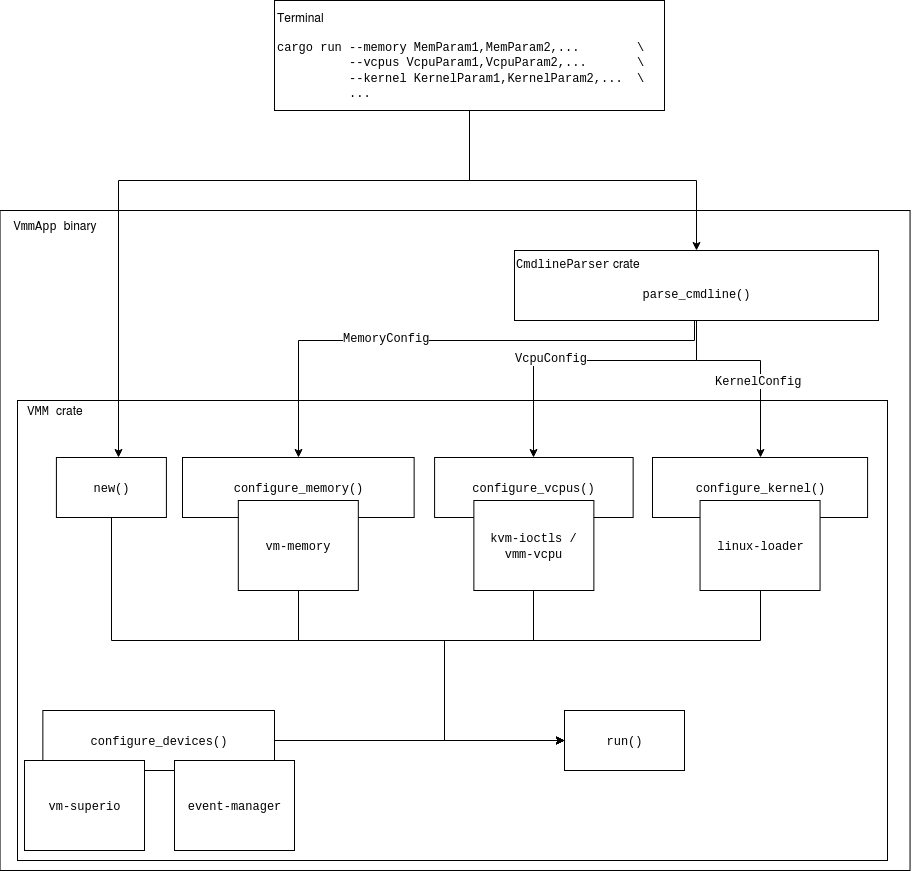
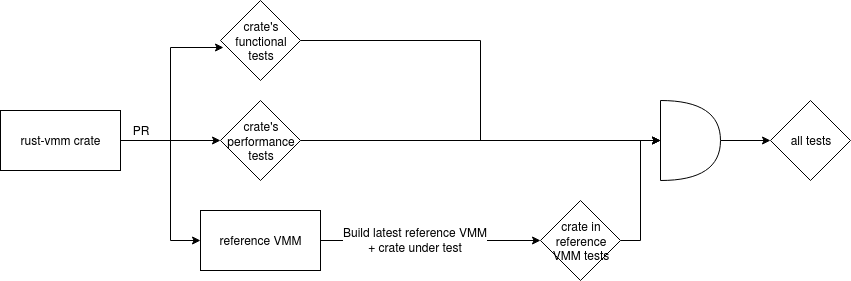

# `rust-vmm` reference VMM Design

## Scope

The reference VMM will not provide any runtime configuration changes to the VM,
the full VM configuration has to be supplied when the VM is started. The simple
command line frontend is oneshot: all the configurations are specified at once,
and the VMM starts with them. To alter its structure, the VMM process must be
killed and re-run with the modified parameters. The core of the reference VMM
is the `vmm` crate, which encapsulates and binds together all the other
functionality-providing crates; the user-facing component is minimalistic and
meant to be discarded when the VMM is forked for new usage, in order for the
user to provide an UI suitable to their needs.

The first iteration of the reference VMM contains a subset of the crates
available in `rust-vmm`:
[`kvm-ioctls`](https://crates.io/crates/kvm-ioctls),
[`kvm-bindings`](https://crates.io/crates/kvm-bindings),
[`vm-memory`](https://crates.io/crates/vm-memory),
[`linux-loader`](https://crates.io/crates/linux-loader),
[`event-manager`](https://crates.io/crates/event-manager),
[`vm-superio`](https://crates.io/crates/vm-superio) and
[`vmm-sys-util`](https://crates.io/crates/vmm-sys-util). Only the serial
console device will be supported. The next iteration will add virtio devices
and vCPU abstractions. Without the latter, vCPU configuration will be handled
directly through `kvm-ioctls` and will not be abstracted through interfaces.

Complex functionalities that require ongoing user interaction with the VMM are
not supported in this version. Such functionalities include but are not
limited to: device hotplug, VM pause/resume, snapshotting, migration. As the
necessary building blocks emerge in `rust-vmm`, integration in the `vmm` crate
will not pose a large effort, but the frontend / app will require extensive
modifications.

## Overview

The reference VMM is composed of 2 major crates packaged in a binary
application: the `vmm` and a oneshot CLI that invokes it. The `vmm` crate
exports an object (`struct VMM`) that encapsulates all the
functionality-providing `rust-vmm` crates, as dependencies. The `VMM` object
exposes public APIs (`pub fn`s) that consume configuration objects, passed
along from the UI component.

Users of the reference VMM can replace the builtin command line parser with
frontends of their own, as long as they adhere to the VMM’s entrypoints by
constructing and passing it specialized `*Config` objects
(`structMemoryConfig` for guest memory configurations, etc.). Alternatively,
users can disregard the `vmm` crate altogether and build their own, referring
to it only for guidelines.



## The `vmm` crate

The `vmm` crate defines and exports a `struct VMM` that can be instantiated,
configured with all the supported `rust-vmm` building blocks, and run. The
crate consumes its `rust-vmm` dependencies them either from
[crates.io](http://crates.io/) or directly from their GitHub repositories, when
they’re sufficiently mature for usage but not yet published. The code compiles
into a single binary, at least until the point in which certain crates (or
features thereof) become mutually incompatible. Should this need arise, we will
combine compatible configurations into multiple VMMs.

### Functionalities

Currently, with no available devices except for the serial console, the
reference VMM can boot a simple Linux kernel with a baked-in `initramfs`.
`*Config` structs passed by the UI are cached in a `VmmConfig` struct until
`run()`, when the VMM is instantiated and the configurations are turned into
live objects.

The steps to running a guest, presuming the configurations are parsed and
stored, are as follows:

1. Set up KVM. This is done through `kvm-ioctls`. It creates the KVM virtual
   machine in the host kernel.
1. Configure guest memory. This is done through the `vm-memory` crate. This
   creates and registers the guest memory with KVM.
    1. Requirements: KVM set up
    1. Inputs
        1. guest memory size - user-defined
1. Load the guest kernel into guest memory. This is done through `linux-loader`.
    1. Requirements: guest memory is configured
    1. Inputs:
        1. path to kernel file - user defined
        1. start of high memory (x86_64) - user defined
        1. kernel command line - user defined
        1. boot parameters - embedded in VMM
            1. Too complex to pass through the command line / other inputs:
               these are arch-dependent structs, built with `bindgen` and
               exported by `linux-loader`, that the user fills in outside
               `linux-loader` with arch- and use case-specific values.
            1. Some can be constants and can be externally specified, unless
               they make the UI unusable. Examples: kernel loader type, kernel
               boot flags, dedicated address for the kernel command line, etc.
1. Configure the vCPUs. This is done directly through `kvm-ioctls`, but belongs
   in the upcoming `vmm-vcpu` crate.
    1. Requirements: KVM is configured, guest memory is configured
    1. Inputs: vCPU registry values - hardcoded / embedded in VMM for the same
       reasons as boot parameters.
    1. Breakdown (`x86_64`):
        1. Create KVM `irqchip`. This creates the virtual IOAPIC and virtual
           PIC and sets up future vCPUs for local APIC.
        1. Configure MPTables. These
           [tables](https://pdos.csail.mit.edu/6.828/2014/readings/ia32/MPspec.pdf)
           tell the guest OS what the multiprocessor configuration looks like,
           and are required even with a single vCPU.
        1. Create vCPUs. An `fd` is registered with KVM for each vCPU.
        1. Configure CPUID. Required (at least) because it’s the means by which
           the guest finds out it’s virtualized.
        1. Configure MSRs (model specific registers). These registers control
           (among others) the processor features. See the
           [reference](https://www.intel.co.uk/content/dam/www/public/us/en/documents/manuals/64-ia-32-architectures-software-developer-system-programming-manual-325384.pdf#G14.8720).
        1. Configure other registers (`kvm_regs`, `kvm_sregs`, `fpu`).
        1. Configure LAPICs.
1. Create event manager for device events. This is done through `event-manager`.
1. Configure legacy devices. This is done partially through `kvm-ioctls`,
   partially (serial console emulation) through `vm-superio`. Device event
   handling is mediated with `event-manager`.
    1. Requirements: KVM is configured, guest memory is configured, `irqchip`
       is configured (`x86_64`), event manager is configured
    1. Inputs: N/A
    1. Breakdown:
        1. Create dummy speaker. This needs to be emulated because some kernels
           access the speaker’s port, leading to continuous KVM exits for the
           otherwise unhandled device IO.
        1. Create serial console.

## User Interface

The primary user interface for the reference VMM is the public facing
programmatic API of the `vmm` crate, which consumes predefined `*Config`
structures passed on by the frontend. In line with the steps-to-boot enumerated
[here](#functionalities), the programmatic API consists of:

```rust
pub struct Vmm {
    pub fn new();
    pub fn configure_guest_memory(&mut self, guest_mem_cfg: MemoryConfig);
    pub fn configure_kernel(&mut self, kernel_cfg: KernelConfig);
    pub fn configure_vcpus(
        &mut self,
        vcpu_cfg: VcpuConfig,
        kernel_load: GuestAddress,
    );
    pub fn configure_pio_devices(&mut self);
    // Room for extensions (e.g. MMIO, PCI)
    pub fn run();
}
```

The simple command line parser creates the `*Config` objects from plaintext
parameters, in `key=value` format, delimited by commas. Alternatively, we can
explore a `serde`-compatible format, as long as it does not warrant significant
effort.

```bash
vmm-reference                                                           \
    --memory mem_size_mib=1024                                          \
    --vcpus num_vcpus=1                                                 \
    --kernel path=/path/to/vmlinux,himem_start=1024,cmdline="pci=off"   \
    [--blk <blkdev_config> - TBD]
    [--net <netdev_config> - TBD]
```

The command line parser is throw-away in the process of users building a new
VMM using the reference VMM as example. It is not considered stable, should
never be used in production, and will not be maintained at the same grade as
the VMM itself. 

As new features are developed in `rust-vmm`, demanding runtime interactions
with the guest (e.g. pause/resume), we will evaluate moving the command line
parser to a separate thread, or other alternatives for an interactive UI.

## Platform support

### Host OS & hypervisor

`rust-vmm` is ultimately meant to be usable across a wide range of host OSes
and hypervisors, with several of the crates already supporting Windows.
Long-term, the reference VMM should support the intersection of all its crates’
supported platforms. Currently, this intersection resolves into Linux hosts
and the KVM hypervisor. The first iteration of the reference VMM will only
support this configuration, returning errors when users attempt to run it on
something else.

### CPU

Long term, the reference VMM will run on `x86_64` and `aarch64` platforms; to
begin with, only Intel `x86_64` CPUs will be supported, as there is no support
for a PIO serial console on `aarch64`, and the virtio interfaces are at an
early stage.

### Rust features

The reference VMM will be compiled with all its crates’ features (at least,
while they’re compatible with each other), and will be able to showcase usage
with all of them in turn. Code-wise, there is only one `vmm` crate, which
activates all its dependencies’ features through its TOML. The integration
tests, documentation and examples will demonstrate the various features’
functionalities. Examples of such features are: driving the event manager from
the same thread or a new one, loading ELF and `bzImage` kernels.

To exemplify this: the same reference VMM binary can boot an ELF or a `bzImage`
kernel, with no need to recompile it. Users control what it will boot, through
the specified parameters (the user supplies the kernel image).

### Toolchain

The reference VMM will support both `glibc` and `musl libc` (toolchains:
`x86_64-unknown-linux-gnu`, `x86_64-unknown-linux-musl`) with `glibc` being the
default due to `x86_64-unknown-linux-gnu` being
[Tier 1 supported](https://doc.rust-lang.org/nightly/rustc/platform-support.html#tier-1)
by Rust. Future extensions to `aarch64` support will introduce the
`aarch64-unknown-linux-gnu` and `aarch64-unknown-linux-musl` toolchains,
defaulting to TBD on ARM (depending on how the official Rust support evolves).

## Testing

The reference VMM will run a minimal battery of integration tests with every
pull request in its repository, leveraging the infrastructure in `rust-vmm-ci`.
These tests will build the VMM with all its dependencies and all their features
compiled-in and boot a guest for several configurations that make sense (as
opposed to, for instance, one configuration with all the possible devices).

As the command line parser is throw-away in the process of users building a new
VMM using the reference VMM as example, we will not focus testing on it. Its
functionalities are covered by unit tests that exercise the parsing
utilities, and by an end-to-end integration test exercises
`cargo run --<params>`. The core component is the `vmm` crate, easily tested
with native Rust code through
[Rust integration tests](https://doc.rust-lang.org/rust-by-example/testing/integration_testing.html).
Each test spawns a VMM in a child process (to ensure proper cleanup of KVM
resources) and demonstrates that the guest is viable. As devices are added, we
will expand the guest `init`s to run minimal workloads, monitoring the outputs
generated by the devices (metrics included).

Each `rust-vmm` crate is responsible to measure, evaluate, and optimize its
performance in an isolated environment. Putting the pieces together, however,
can bring up unexpected issues that don’t manifest in isolation; therefore,
each crate included in the reference VMM will be tested in a dedicated test
battery that introduces the WIP version (either the `HEAD` in a pull request,
or the upstream one in nightly test runs) in the latest reference VMM
(considered stable). These tests will not block the PR in the crate if they
fail - for instance, the process of changing a crate’s interfaces is expected
to break the reference VMM until it’s updated.


